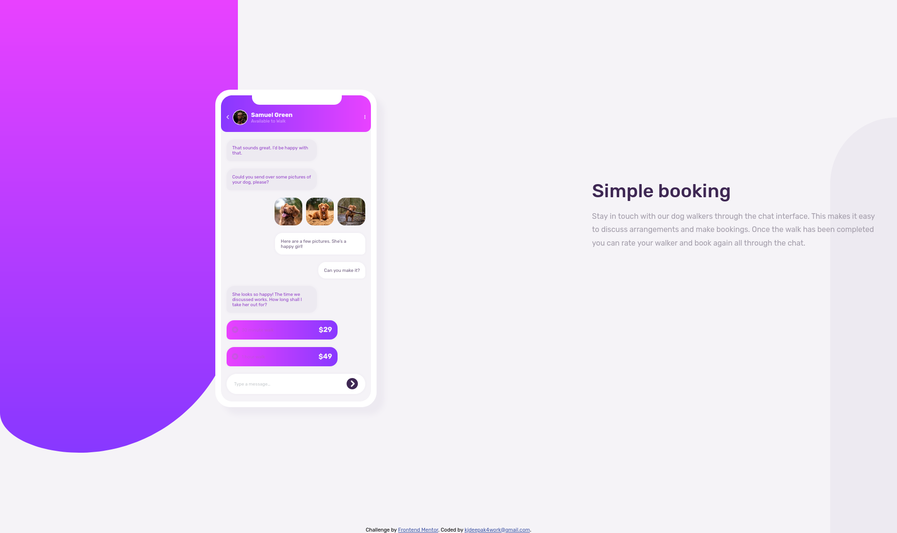

# Frontend Mentor - Chat app CSS illustration solution

This is a solution to the [Chat app CSS illustration challenge on Frontend Mentor](https://www.frontendmentor.io/challenges/chat-app-css-illustration-O5auMkFqY). Frontend Mentor challenges help you improve your coding skills by building realistic projects. 

## Table of contents

- [Overview](#overview)
  - [Screenshot](#screenshot)
  - [Links](#links)
- [My process](#my-process)
  - [Built with](#built-with)
  - [What I learned](#what-i-learned)
  - [Useful resources](#useful-resources)
- [Author](#author)

## Overview

### Screenshot

### Links

- Solution URL: [https://github.com/kjdeepak/chat-app](https://github.com/kjdeepak/chat-app)
- Live Site URL: [https://chat-app-kjdeepak.vercel.app/](https://chat-app-kjdeepak.vercel.app/)

## My process

### Built with

- Semantic HTML5 markup
- CSS3
- SCSS
- Flexbox
- Mobile-first workflow

## Author

- Website - [K J Deepak](https://kjdeepak.com/)
- Github - [@kjdeepak](https://github.com/kjdeepak)
- Frontend Mentor - [@kjdeepak](https://www.frontendmentor.io/profile/kjdeepak)
- Twitter - [@k_j_deepak](https://www.twitter.com/k_j_deepak)